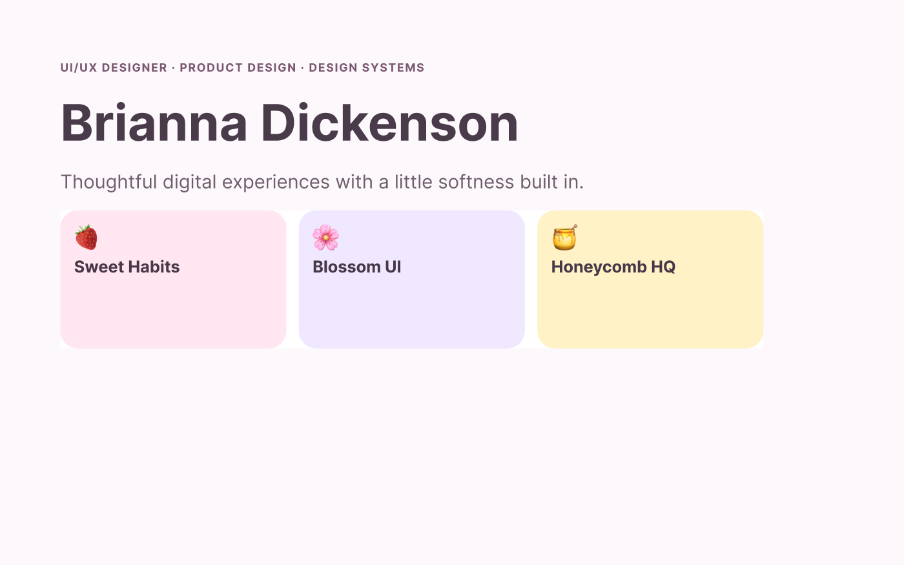
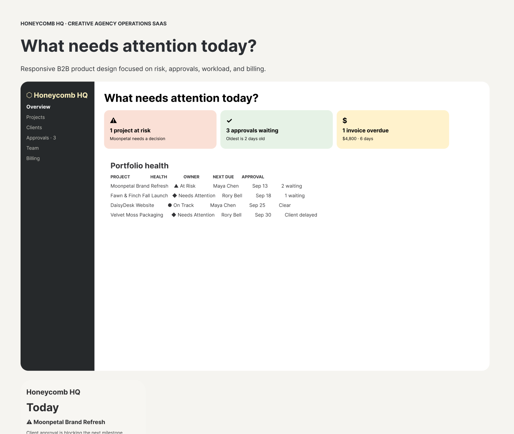

# 🎀 Brianna Dickenson 🎀

### **UI/UX Designer | Product Design · Design Systems**

I design thoughtful, accessible web and mobile experiences from **research and information architecture** through **high-fidelity UI, prototyping, testing, and developer handoff**.

---

## 💌 Work With Me

🕓 **Seeking Full Time Remote Position**  

💌 **Available For Freelance** 

🌐 **[View Live Portfolio](https://ui-ux-designer-psi.vercel.app/)**

---

## 🧠 Core Stack

**Product & UX:** Problem framing · User research · User flows · Information architecture · Wireframing · Usability testing · Iteration 
**UI & Prototyping:** Figma · FigJam · Framer · Adobe Creative Cloud · High-fidelity UI · Responsive design · Interactive prototypes · Microinteractions  
**Design Systems:** Components · Variants · Variables · Design tokens · Documentation · Usage guidelines  
**Accessibility:** WCAG 2.2-informed design · Contrast · Focus states · Touch targets · Reduced motion  
**Handoff & Collaboration:** Storybook · Git · HTML · CSS · Tailwind CSS · React · Figma Dev Mode · Developer handoff · Responsive specs · Interaction notes · Storybook familiarity · Git
**Research & Collaboration:**  Maze · Miro · Notion · Google Forms

---

## 🌷 Featured Work

<table>
<tr>
<td width="260" valign="top">  <a href="https://ui-ux-designer-psi.vercel.app/sweet-habits/">🌐 Live Prototype</a> · <a href="./sweet-habits/README.md">📖 Case Study</a> · <a href="https://www.figma.com/design/3BObCtX2MJOLX0rZgTg1Vn?node-id=1-16">🎨 Figma</a></td>
<td valign="top">
<h3>🍓 Sweet Habits — Mobile Product Redesign</h3>

Consumer Mobile | End-to-end UX, emotional interaction design, accessible habit flows

A cozy habit-tracking redesign focused on reducing friction and making routine-building feel encouraging rather than clinical.

<strong>Demonstrates:</strong> problem framing · research planning · user flows · information architecture · wireframing · interface iteration · high-fidelity mobile UI · reduced-motion considerations

<strong>Process &amp; Tools:</strong> Figma · FigJam · user flows · wireframes · interactive prototype · accessibility-minded states · developer handoff

<strong>Design goal:</strong> Make essential habit actions fast and clear while keeping progress feedback supportive, calm, and useful rather than punitive.

</td>
</tr>
</table>

<table>
<tr>
<td width="260" valign="top">  <a href="https://ui-ux-designer-psi.vercel.app/blossom-ui/">🌐 Live Design System</a> · <a href="./blossom-ui/README.md">📖 Case Study</a> · <a href="https://www.figma.com/design/3BObCtX2MJOLX0rZgTg1Vn?node-id=1-43">🎨 Figma</a></td>
<td valign="top">
<h3>🌸 Blossom UI — Modular Design System</h3>

Design System | Components, tokens, accessibility, responsive behavior, handoff

A feminine, floral-inspired design system for responsive web and mobile products, demonstrating how a distinctive visual language can remain consistent, scalable, accessible, and developer-friendly.

<strong>Demonstrates:</strong> design tokens · variables · component architecture · variants · interaction states · responsive patterns · accessibility specifications · usage guidance

<strong>Process &amp; Tools:</strong> Figma variables · reusable components · interactive states · coded design-system showcase · documentation · Figma Dev Mode / Storybook-ready handoff thinking

<strong>Design goal:</strong> Prove that an expressive feminine visual system can scale across products without sacrificing consistency, usability, accessibility, or implementation clarity.

</td>
</tr>
</table>

<table>
<tr>
<td width="260" valign="top">  <a href="https://ui-ux-designer-psi.vercel.app/honeycomb-hq/">🌐 Live Prototype</a> · <a href="./honeycomb-hq/README.md">📖 Case Study</a> · <a href="https://www.figma.com/design/3BObCtX2MJOLX0rZgTg1Vn?node-id=1-77">🎨 Figma</a></td>
<td valign="top">
<h3>🍯 Honeycomb HQ — Creative Agency Operations SaaS</h3>

B2B SaaS | Complex workflows, responsive product design, data-dense operational UX

A responsive operations workspace for small creative agencies managing clients, projects, approvals, deadlines, team workload, and billing.

<strong>Demonstrates:</strong> complex information architecture · dashboard prioritization · tables · search · filtering · workflow states · responsive desktop-to-mobile design · error prevention · accessibility

<strong>Process &amp; Tools:</strong> Figma · role-based flows · responsive wireframes · interactive prototype · coded workflow states · accessibility-minded interaction design · developer handoff

<strong>Design goal:</strong> Help agency operators identify what needs attention now, understand why it matters, and take action without reconstructing project status across disconnected tools.

</td>
</tr>
</table>

---

## 🌈 How I Work

1. **Understand** — define the problem, audience, constraints, and success criteria.
2. **Structure** — map journeys, flows, content hierarchy, and information architecture.
3. **Explore** — sketch and wireframe multiple approaches before committing to visual polish.
4. **Design** — create accessible, responsive high-fidelity interfaces and interaction states.
5. **Validate** — test assumptions, document findings, and iterate based on evidence.
6. **Handoff** — prepare components, specifications, states, and implementation notes for development.

---

## 🌸 Explore My Work

My portfolio is intentionally separated by specialty so each discipline can tell a focused story while still showing how my skills connect.

- 🎀 **UI/UX Designer** — product design, research, flows, design systems, prototyping, and complex interaction design
- 💻 [Front-End Developer](https://github.com/breyhanaariel/front-end-developer) — React, Next.js, TypeScript, APIs, testing, and accessible implementation
- 🌐 [Web Designer](https://github.com/breyhanaariel/web-designer) — responsive websites and brand-led digital experiences for short-term client projects
- 🎨 [Graphic Designer](https://github.com/breyhanaariel/graphic-designer) — brand identity, campaign design, marketing assets, print, and motion
