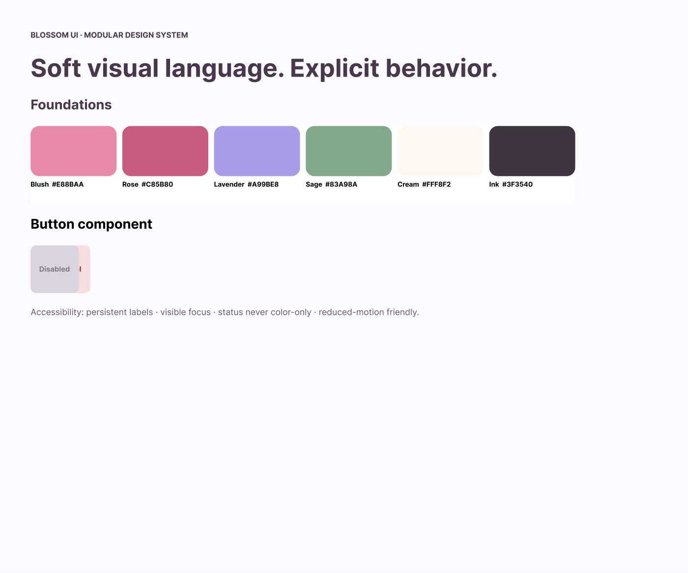
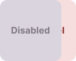

# 🌸 Blossom UI — Modular Design System
### **Design Systems · Components · Accessibility · Developer Handoff**



**Blossom UI** is a feminine, floral-inspired design system concept for responsive web and mobile products.

The goal is to demonstrate that a soft, expressive visual language can still be **systematic, scalable, accessible, and implementation-ready**.

🌐 **Live Design System:** [Explore Blossom UI](https://ui-ux-designer-psi.vercel.app/blossom-ui/)  
🌷 **Figma Library:** [View Blossom UI](https://www.figma.com/design/CpSMZrgQWTAxjiks0OKxST?node-id=1-59)  
📘 [Design System Specification](./DESIGN_SYSTEM_SPEC.md)  
🧩 [Component Inventory](./COMPONENT_INVENTORY.md)  
♿ [Accessibility Guidelines](./ACCESSIBILITY.md)  
💻 [Developer Handoff](./HANDOFF.md)  
🖼️ [Visual Asset Checklist](./assets/README.md)

---

## 💐 Project Snapshot

| | |
|---|---|
| **Role** | UI/UX Designer / Design System Designer |
| **Project Type** | Independent design-system case study |
| **Platforms** | Responsive web + mobile |
| **Status** | Figma foundations/components + coded interactive showcase complete |
| **Primary Tool** | Figma |
| **Focus** | Tokens · Components · States · Documentation · Accessibility · Handoff |

---

## 🌷 Design Challenge

> **How might a design system preserve a warm, distinctive brand personality while giving product teams predictable components, accessible behavior, and reusable implementation rules?**

Blossom UI is not intended to be a collection of pretty components. It should function as a small but coherent product system.

---

## 🌼 System Principles

### 1. Harmony
Shared tokens and component rules create visual consistency across products.

### 2. Empathy
Accessibility behavior is specified as part of the component, not added after visual design.

### 3. Clarity
Component names, variants, states, and usage guidance should be understandable to both designers and developers.

### 4. Delight
Soft motion, floral color, and rounded forms can add personality without interfering with task completion.

### 5. Scalability
Patterns should work across multiple screens and responsive breakpoints rather than being optimized for one mockup.

---

## 🌹 System Architecture

```
Blossom UI
├── Foundations
│   ├── Color
│   ├── Typography
│   ├── Spacing
│   ├── Radius
│   ├── Elevation
│   ├── Grid
│   └── Motion
├── Tokens / Variables
│   ├── Primitive tokens
│   ├── Semantic tokens
│   └── Component tokens
├── Components
│   ├── Actions
│   ├── Inputs
│   ├── Navigation
│   ├── Feedback
│   └── Content
├── Patterns
│   ├── Forms
│   ├── Dialog flows
│   ├── Empty states
│   └── Data / settings layouts
└── Example Products
    ├── Responsive web screen
    └── Mobile screen
```

---

## 🎨 Planned Foundations

| Foundation | Direction |
|---|---|
| **Color** | Blush · cream · lavender · sage with semantic status roles |
| **Typography** | Expressive headings + highly readable UI/body text |
| **Spacing** | Predictable scale rather than screen-specific values |
| **Radius** | Soft rounded hierarchy with limited tiers |
| **Elevation** | Subtle elevation used to explain layer and interaction |
| **Grid** | Responsive layout rules for desktop, tablet, and mobile |
| **Motion** | Short functional transitions + reduced-motion alternatives |

---

## 🧩 Component Philosophy



Every production-ready component should define:

- Anatomy
- Variants
- Sizes
- Interaction states
- Responsive behavior
- Accessibility behavior
- Content guidance
- When to use / when not to use
- Developer notes

See [COMPONENT_INVENTORY.md](./COMPONENT_INVENTORY.md).

---

## 🌺 Planned Example Screens

The system will be demonstrated in context rather than only as isolated components.

### Responsive web
A lightweight account / workspace settings experience using:
- Navigation
- Form controls
- Cards
- Tabs
- Feedback messages
- Dialogs

### Mobile
A companion settings or profile flow using the same design language and semantic tokens.

These screens should prove that the system scales beyond a component specimen page.

---

## ♿ Accessibility

Blossom UI will be **designed and evaluated against relevant WCAG 2.2 AA criteria**.

Accessibility documentation includes:
- Color and non-text contrast
- Keyboard behavior
- Focus states
- Labels / accessible names
- Error messaging
- Target sizing
- Motion preferences
- Non-color status indicators

➡️ [Read Accessibility Guidelines](./ACCESSIBILITY.md)

---

## 💻 Developer Handoff

The project includes a handoff specification covering:
- Token naming
- Component naming
- Variant/state mapping
- Responsive behavior
- Interaction notes
- Accessibility requirements
- Suggested Storybook parity

➡️ [Read Developer Handoff](./HANDOFF.md)

---

## 🖼️ Portfolio Asset Status

Core visual artifacts now exist in `assets/`, including the design-system hero and component presentation. The checklist remains available for future expansion.

➡️ [See Visual Asset Checklist](./assets/README.md)

---

## 🌸 What This Case Study Demonstrates

Blossom UI demonstrates that I can create more than attractive screens: I can define a **reusable interface language**, document its logic, account for accessibility, and translate design-system thinking into an interactive coded showcase.
