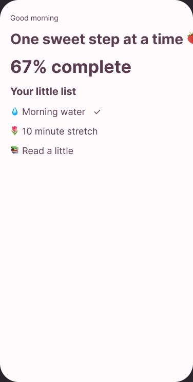

# 🍓 Sweet Habits — Full Case Study

> **Status:** Portfolio structure complete. Visual artifacts and real research findings will be added as they are created.

---

## 1. 🌷 Project Overview

**Sweet Habits** is an independent mobile-product redesign case study focused on making habit tracking feel less clinical and more supportive.

### Design question
> **How might we make creating and completing everyday habits feel simple, calm, and encouraging without hiding important progress information?**

### Scope
- Mobile-first experience
- Habit creation
- Daily completion
- Progress feedback
- Habit editing
- Reminder settings
- Accessibility and reduced-motion considerations

---

## 2. 🎯 Problem Framing

### Observed product-space tension
Habit trackers often need to balance:
- Speed vs. customization
- Accountability vs. pressure
- Data richness vs. visual calm
- Delight vs. distraction

### Working hypothesis
A smaller core flow, clear visual hierarchy, and encouraging feedback may make the experience feel easier to return to.

**This is a design hypothesis, not a validated research finding yet.**

---

## 3. 🧠 Research Plan

### Questions to investigate
- What makes people stop using habit trackers?
- Which setup options are essential on day one?
- Which forms of feedback feel encouraging vs. stressful?
- How much progress information belongs on the home screen?
- Do users understand mascot/motion feedback as system status?

### Planned methods
1. Competitive audit
2. 5–8 short interviews
3. Affinity mapping
4. Task-based usability test
5. Iteration and second test where useful

📌 **Visual slot:** `assets/01-research-summary.png`

---

## 4. 🪞 User Needs & Jobs

Rather than inventing a persona and presenting it as research, the first version uses provisional user jobs:

- “Help me see what I need to do today.”
- “Let me add a habit without a long setup process.”
- “Give me feedback when I make progress.”
- “Let me recover from missed days without making the product feel punishing.”
- “Show me trends when I want them, not all at once.”

After interviews, these should be revised using actual patterns.

📌 **Visual slot:** `assets/02-user-needs.png`

---

## 5. 🗺️ Information Architecture & User Flow

### Primary flow
`Home → Add Habit → Configure → Save → Complete → Feedback → Progress`

### Secondary flows
- Edit habit
- Pause / archive habit
- Reminder settings
- Weekly progress
- Reduced-motion preference

📌 **Visual slot:** `assets/03-primary-user-flow.png`

---

## 6. ✏️ Wireframes

Create multiple low-fidelity approaches before choosing the final structure.

### Minimum exploration set
- Home / Today — 2–3 layouts
- Add Habit — 2 layouts
- Habit Details — 2 layouts
- Progress — 2 layouts
- Completion feedback — 2 treatments

For each chosen direction, document **why it won**.

📌 **Visual slot:** `assets/04-wireframe-exploration.png`

---

## 7. 🍰 Iteration Story

This section should become one of the strongest parts of the case study.

For each major decision, use this format:

### Decision
What changed?

### Reason
What usability, hierarchy, accessibility, or product issue did the change solve?

### Before
📌 `assets/05-before-example.png`

### After
📌 `assets/06-after-example.png`

### Evidence
Add actual test observations after testing. Do not invent percentages.

---

## 8. 🎨 Visual System

### Foundations to define
- Color roles
- Typography scale
- Spacing scale
- Radius scale
- Elevation
- Icon style
- Illustration / mascot rules
- Motion duration and easing

### Components
- Buttons
- Inputs
- Habit cards
- Progress indicators
- Tabs / navigation
- Modals / sheets
- Toasts / confirmations

📌 **Visual slot:** `assets/07-ui-foundations.png`

---

## 9. ✨ Final UI Screens

Minimum final-screen set:
1. Onboarding / introduction
2. Today dashboard
3. Add habit
4. Habit configuration
5. Completion feedback
6. Weekly progress
7. Habit details / edit
8. Settings / reduced motion

📌 **Visual slot:** `assets/08-final-ui-overview.png`

---

## 10. 🩰 Prototype

The interactive prototype should demonstrate:
- First-time entry
- Habit creation
- Habit completion
- Progress review
- Edit habit
- Reduced-motion alternative

🎨 **Figma design:** [View Sweet Habits](https://www.figma.com/design/CpSMZrgQWTAxjiks0OKxST?node-id=1-32)

See [Interactive_Prototype.md](./Interactive_Prototype.md).

---

## 11. 🧪 Usability Testing

### Planned sample
Aim for **5–8 participants** for a small qualitative portfolio study.

### Core tasks
- Add a daily habit.
- Set a reminder.
- Complete a habit.
- Find weekly progress.
- Edit the habit.

### Capture
- Task success / failure
- Misclicks or hesitation
- Assistance required
- Qualitative comments
- Severity of issues
- Changes made afterward

📌 **Visual slot:** `assets/09-usability-findings.png`

### Results
**Not tested yet. No outcome statistics are claimed.**

---

## 12. ♿ Accessibility Review

Evaluate:
- Text contrast
- Component contrast
- Minimum target sizes
- Focus state specifications
- Non-color status indicators
- Reduced-motion behavior
- Text scaling
- Error identification
- Intended accessible names

📌 **Visual slot:** `assets/10-accessibility-review.png`

---

## 13. 💻 Developer Handoff

Document:
- Component states
- Responsive assumptions
- Spacing and layout rules
- Motion behavior
- Accessible names / semantics
- Empty, error, loading, and success states

📌 **Visual slot:** `assets/11-handoff-example.png`

---

## 14. 🌸 Reflection

When the project is complete, answer:
- What changed most between the first and final design?
- What did testing contradict?
- Which trade-off was hardest?
- What would be tested next?
- What would change if this were shipped as a real product?

This section should emphasize **decision-making**, not just visual polish.
