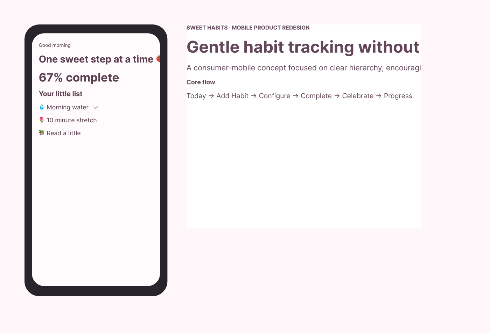

# 🍓 Sweet Habits
### **Mobile Habit Tracker · UI/UX Redesign Case Study**

**Sweet Habits** is a cozy mobile habit-tracking concept exploring how routine-building can feel **encouraging, focused, and emotionally supportive** instead of clinical or overwhelming.

This project is being developed as an **independent portfolio case study**. Research findings, usability results, and outcomes will only be presented as measured results after real testing is completed.

🌐 **Live Prototype:** [Try Sweet Habits](https://ui-ux-designer-psi.vercel.app/sweet-habits/)  
🎨 **Figma Design:** [View Sweet Habits](https://www.figma.com/design/3BObCtX2MJOLX0rZgTg1Vn?node-id=1-16)  
📄 [Full Case Study](./Figma_Case_Study.md)  
🧠 [UX Documentation](./UX_Documentation.md)  
✨ [Prototype Specification](./Interactive_Prototype.md)  
🖼️ [Visual Asset Checklist](./assets/README.md)

---

## 🌷 Project Snapshot

| | |
|---|---|
| **Role** | UI/UX Designer |
| **Project Type** | Independent product redesign case study |
| **Platform** | Mobile |
| **Status** | Interactive design + coded prototype complete · Research validation planned |
| **Primary Tools** | Figma · FigJam · Maze |
| **Focus** | Habit creation · Daily tracking · Progress feedback · Accessibility |

---

## 🎯 Design Challenge

Many habit-tracking products are feature-dense and productivity-oriented. Sweet Habits explores a different question:

> **How might a habit tracker make the essential actions simple while still giving users warm, motivating feedback?**

The project intentionally focuses on a small set of core jobs:
1. Understand today's habits.
2. Add or edit a habit quickly.
3. Mark progress without friction.
4. Understand longer-term progress.
5. Receive encouraging feedback without creating pressure.

---

## 🍰 Product Principles

- **Simple before clever** — prioritize the primary habit flow over feature quantity.
- **Encouraging, not punitive** — avoid shame-based streak language.
- **Delight with purpose** — motion and mascots should reinforce system feedback.
- **Accessible by design** — color, motion, hierarchy, labels, and touch targets are considered from the beginning.
- **Calm visual density** — use whitespace and progressive disclosure instead of crowding screens.

---

## 🗺️ Planned Core Flow

`Home → Add Habit → Configure Habit → Save → Complete Habit → Celebration / Feedback → Progress`

Secondary flows to document:
- Edit / pause a habit
- Recover from a missed day
- Change reminder settings
- Review weekly progress
- Enable reduced motion

---

## 🧪 Research & Testing Status

No user-testing statistics are claimed yet.

The case study includes a research and testing plan so that future findings can be documented honestly.

### Planned methods
- Lightweight competitive audit
- Short user interviews
- Task-based usability testing
- Post-task satisfaction questions
- Affinity mapping of qualitative feedback

### Planned usability tasks
- Add a new daily habit.
- Set a reminder.
- Complete today's habit.
- Find weekly progress.
- Edit an existing habit.

See [UX_Documentation.md](./UX_Documentation.md) for the full plan.

---

## 🎨 Planned Deliverables

- Problem statement and project constraints
- Competitive observations
- Research plan
- Primary user flow
- Low-fidelity wireframes
- Exploration / iteration screens
- Mobile UI foundations
- High-fidelity key screens
- Interactive prototype
- Accessibility annotations
- Usability test plan + real findings when completed
- Developer handoff notes

---

## 🌈 Visual Direction

| Element | Direction |
|---|---|
| **Color** | Blush pink · lavender · mint · cream |
| **Typography** | Friendly rounded sans serif with strong readability |
| **Shape Language** | Rounded cards and controls |
| **Illustration** | Small mascot moments used as feedback, not decoration-only |
| **Motion** | Gentle, short transitions with a reduced-motion alternative |
| **Tone** | Kind · cozy · clear · encouraging |

---

## ♿ Accessibility Approach

Sweet Habits will be **designed and evaluated against relevant WCAG 2.2 AA criteria** rather than presented as certified compliant.

Planned checks include:
- Text and UI contrast
- Touch target sizing
- Clear labels and error messaging
- Logical focus order annotations
- Reduced-motion behavior
- Text scaling resilience
- Non-color indicators for status and progress

---

## 🧁 Portfolio Asset Status

Core portfolio visuals now exist in `assets/`, including the hero and final UI presentation. The asset checklist remains as a roadmap for optional deeper case-study exports.

➡️ [See the visual asset checklist](./assets/README.md)

---

## 💌 What This Case Study Demonstrates

Sweet Habits demonstrates a consumer-mobile workflow from **problem framing → UX structure → UI exploration → interactive prototype → accessibility-minded implementation** while preserving a distinctive emotional brand. Real user-testing findings remain intentionally separate until research is completed.
